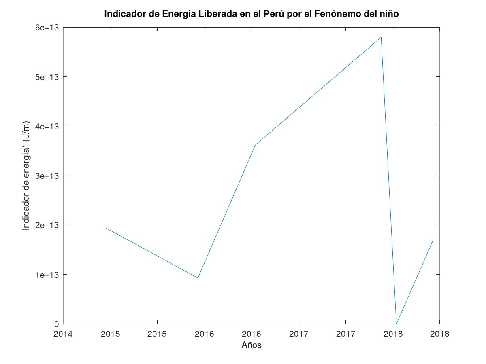
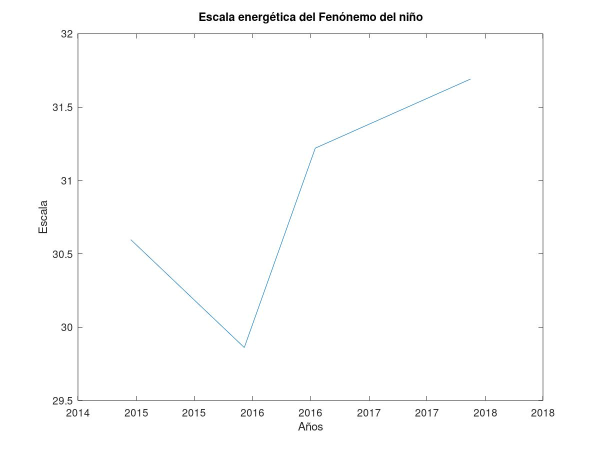

## Escala energetica del Fenomeno del niño

En Perú, cada año el fenomeno del niño produce millonarias perdidas, asi como la perdida de calidad de vida en la poblacion. Urge entonces medir adecuadamente el impacto del fenomeno del niño. Este proyecto esta basado en la [escala de sismológica de Ritcher](https://es.wikipedia.org/wiki/Escala_sismol%C3%B3gica_de_Richter), la cual sirve para medir la energía liberada por un terremoto, asi como para establecer normativas que hacen los edificion mas seguros contra los terremotos.

### Comparación entre el Fenomeno del niño vs Un terremoto

| Fenomeno del niño  | Terremoto |
| ------------- | ------------- |
| Consiste en una liberacion de energia transmitida por el agua.  | Consiste en una liberacion de energia en forma de movimiento.  |
| Puede causar caida de multiples edificios, dependiendo de su impacto  | Puede causar caida de multiples edificios, dependiendo de su impacto  |
| No ha sido normado en el [Reglamento Nacional de Edificaciones](www.urbanistasperu.org/rne/.../Reglamento%20Nacional%20de%20Edificaciones.pdf) por lo que su impacto sigue siendo catastrofico año tras año. | Esta correctamente normado en el [Reglamento Nacional de Edificaciones](www.urbanistasperu.org/rne/.../Reglamento%20Nacional%20de%20Edificaciones.pdf) |

### Como funciona la escala de ritcher
Segun la pagina web [muyinteresante](https://www.muyinteresante.es/ciencia/preguntas-respuestas/como-funciona-la-escala-de-richter-501481801518),  La escala sismológica de Richter o escala de magnitud local (ML), es una escala logarítmica arbitraria que asigna un número para cuantificar la energía liberada en un terremoto, denominada así en honor del sismólogo estadounidense Charles Richter (1900-1985).


### Implementacion de la escala de rither en el [Reglamento Nacional de Edificaciones](www.urbanistasperu.org/rne/.../Reglamento%20Nacional%20de%20Edificaciones.pdf) 
[LA NORMA TÉCNICA E.030 “DISEÑO SISMORRESISTENTE” DEL REGLAMENTO NACIONAL DE EDIFICACIONES](https://www.sencico.gob.pe/descargar.php?idFile=1930) cuenta con un profundo analisis de zonificacion de acuerdo a la vulnerabilidad de las regiones del Perú ante los eventos sísmicos. En el Capitulo 2: Peligro Sismico, se muestra un mapa el pais,, como menciona el documento:
> basado en la distribución espacial de la sismicidad observada, las características generales de los movimientos sísmicos y la atenuación de éstos con la distancia epicentral, así como en la información  neotectónica.


### Importancia
Urge desarrollar una escala logarítmica arbitraria que asigna un número para cuantificar la energía liberada en un desastre del fenomeno del niño. Para lograr las siguientes beneficios.
1. Zonificacion del pais respecto a la vulnerabilidad ante un evento del fenomeno del niño.
1. Implementacion de la normativa en el [Reglamento Nacional de Edificaciones](www.urbanistasperu.org/rne/.../Reglamento%20Nacional%20de%20Edificaciones.pdf) para asegurar que los demas puentes y edificios construidos a futuro sean resistentes a los embates del fenomeno del niño.
1. Fiscalizacion de las construcciones futuras
1. Prevencion de desastres al identificar aquellos edificios que no cuenten con la normativa necesaria.
1. Peritaje de construcciones defectuosas y sanciones a las instituciones implicadas en caso de cometer infraccion alguna y poner en riezgo la vida de las personas.

### Fuentes de Informacion
1. [IMARPE: Temperatura superficial del mar y anomalías térmicas, Salinidad Superficial del Mar](http://www.imarpe.pe/imarpe/index.php?id_seccion=I0178030103000000000000)
1. [NASA: The Fleet Numerical Meteorology and Oceanography Center (FNMOC) Global Hybrid Coordinate Ocean Model (HYCOM)](https://www.ncdc.noaa.gov/data-access/model-data/model-datasets/navoceano-hycom-glb)
Respecto a 1, el INSTITUTO   DEL   MAR   DEL   PERU muestra el cambio de temperatura del mar peruano durante el fenomeno del niño.
#### Temperatura normal del mar
  
#### Temperatura del mar durante Fenomeno del niño

### Propuesta de escala y medicion del impacto del fenomeno del niño
Mediante los datos proveidos por la NASA, es posible calcular la un indicador de la energía acumulada mediante un calculo del cambio de entalpia en el mar mediante la siguiente ecuacion:
```
energia= area*(Diferencia de Temperatura)*(Calor Especifico del agua)*(Densidad del Agua)
Escala = ln(energia)
```
### Significado Fisico
El numero obtenido mediante la ecuacion anterior, es un **indicador de energia acumulada en el mar** en unidades de [J/m] parametro de aumenta de manera dramatica durante los meses de diciembre-enero, produciendo lluvias torrenciales a nivel nacional.

### Codigo Usado
El codigo usado en este proyecto se encuentra en el [presente repositorio](https://github.com/nandorrb/el_nino_magnitude_scale/)
### Resultados Obtenidos
La siguiente imagen es un cuadro que muestra la energia acumulada en el mar durante los ultimos 4 años.

La siguiente Imagen muestra la escala de desastre del fenomeno del niño durante los ultimos cuatro años, teniendo como referencia las mediciones hechas por la NASA el dia **01/13/2018**. Como se puede observar, en el intervalo de tiempo entre el año **2017-2018** hubo una gran descarga de energia, lo cual se traduce en un gran impacto en el fenomeno del niño.


### Conclusion
Es viable crear una escala logaritmica para el analisis y prevencion del fenomeno del niño, por lo que su implementacion dependerá de la importancia que le den las autoridades correspondientes. 

